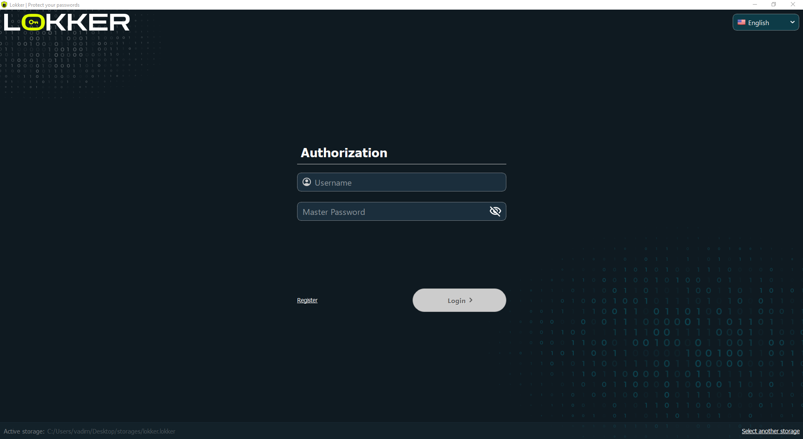
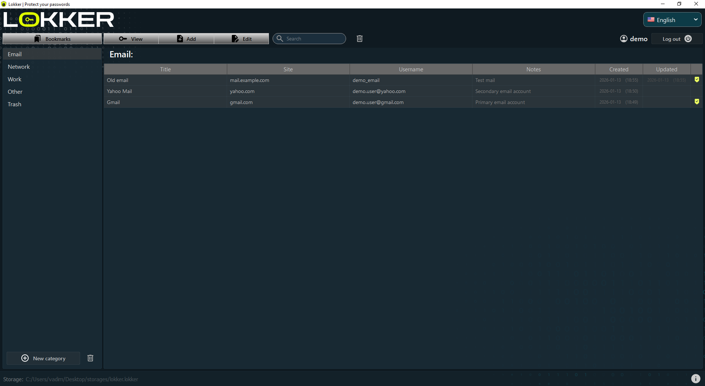

# 🔐 LOKKER — Secure Password Manager

 

Live demo: 🔗 [LOKKER](https://lokkerpassword.vercel.app/

## Overview

**LOKKER** is an offline-first, security-focused password manager designed for Windows.
It emphasizes local data protection, strong cryptography, and zero data exfiltration.

The project demonstrates real-world security practices, thoughtful architecture decisions,
and clean separation between desktop application logic and web presentation layer.

> 🖥️ **Windows-only distribution**  
> The landing page automatically detects the user platform.  
> Download buttons are enabled only on Windows to ensure a correct installation experience.

#### Navigation:

- [Key Principles](#key-principles)
- [Key Features](#key-features)
- [Key Derivation](#key-derivation)
- [Encryption](#encryption)
- [LOKKER Screenshots](#lokker-screenshots)
- [Tech Stack](#tech-stack)
- [Project Structure](#project-structure)
- [Links](#links)
- [Live Demo](#live-demo)
- [Contacts](#contacts)

---

## Key Principles
[Back to Navigation](#navigation)

- 🔒 Local-only encryption — data never leaves the user’s device
- 🧠 Strong cryptography by design
- 📴 No cloud, no telemetry, no tracking
- 🖥️ Desktop-first UX
- 🌍 Multilingual support
- 🧩 Clear, maintainable architecture

---

## Key Features
[Back to Navigation](#navigation)

- 🖥️ Intuitive PySide6 desktop interface
- 🌍 Runtime language switching (RU / EN / ES / DE)
- 🔐 Password encryption using AES-256-GCM
- 🧠 Master password–based key derivation using PBKDF2-HMAC-SHA256
  - 600,000 iterations
  - Unique salt per user
- 🔍 Fast search and favorites
- 📁 Flexible password categorization
- 📴 Fully offline operation

---

## Key Derivation
[Back to Navigation](#navigation)

The master password is never stored. 
Instead, a cryptographic key is derived using:

- PBKDF2-HMAC-SHA256
- 600,000 iterations
- Unique per-user salt

This approach significantly slows down brute-force and dictionary attacks.

---

## Encryption
[Back to Navigation](#navigation)

Algorithm: AES-256-GCM 
Mode: Authenticated encryption

Each record uses:
- Unique nonce
- Authentication tag

This ensures:
- Confidentiality
- Integrity
- Tamper detection

---

## LOKKER Screenshots:
[Back to Navigation](#navigation)

### Application UI:

### Web UI:

---

## Tech Stack
[Back to Navigation](#navigation)

### Desktop Application:

- Desktop Application
- Python 3.12
- PySide6
- cryptography
- SQLite

### Landing Page:

- React
- TypeScript
- Redux
- React Router
- Sass / CSS Modules
- Framer Motion

---

## Project Structure
[Back to Navigation](#navigation)

- 📁 /src
  - 📁 /components - Shared UI components
    - 📁 /common - Component elements
  - 📁 /constants - Application constants
  - 📁 /fonts - Fonts
  - 📁 /i18n - Translations
  - 📁 /pages
    - 📁 /DetailPage - Technical security information
      - 📝 DetailPage.module.scss
      - 📝 DetailPage.tsx
    - 📁 /MainPage - Landing page main view 
      - 📝 MainPage.module.scss
      - 📝 MainPage.tsx
  - 📁 /scss - SCSS variables and mixins
  - 📁 /sections - Page sections
  - 📁 /services - Language and utility services
  - 📁 /store
    - 📁 reducers
    - 📁 selectors
  - 📁 /types - Interfaces
    - 📝 index.ts
    - 📝 translationType.ts
  - 📝 App.js - Application entry point

---

## Links
[Back to Navigation](#navigation)

- Full application source code and documentation:
  - 🔗 [GitLab — LOKKER](https://gitlab.com/vadim_nevinskiy/passwords)
  
- Windows installer: 
  - 🔗 [LokkerSetup.exe](https://gitlab.com/vadim_nevinskiy/passwords/-/raw/main/dist/LokkerSetup.exe) 

---

## Live Demo
[Back to Navigation](#navigation)

🔗 [LOKKER](https://lokkerpassword.vercel.app/)

---

## License
[Back to Navigation](#navigation)

This project is licensed under the MIT License.

---

## Contacts
[Back to Navigation](#navigation)

### Author
Vadim Nevinskiy 
Python / React developer

📧 Email: `nevinskiyvadim@gmail.com`  
💬 Telegram: `https://t.me/vadim_nevinskiy`

💻 GitLab:

- Landing Page: https://gitlab.com/vadim_nevinskiy/passvault_page
- Application: https://gitlab.com/vadim_nevinskiy/passwords
- Telegram: https://t.me/+v4X5ohXRyI1kMzEy

📅 Date: January 17, 2026

---

## Final Note
[Back to Navigation](#navigation)

LOKKER is designed as a realistic security-focused product, not a tutorial or toy project.
It demonstrates practical cryptography, thoughtful UX, and clean architecture.
